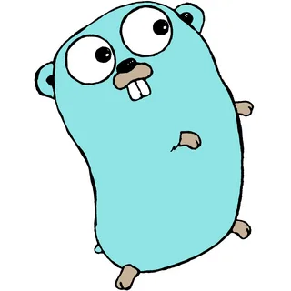

# Schedule project
This project is for educational purposes only. It was quite presumptuous to believe that i will change wsp system only by motivation and some teamwork while only learning golang. </br>Maybe in the future i will use this project as the starting point of something bigger, but now it's the simpliest rest api app that could be. Probably i won't be able to write it by myself, so thanks to you teacher for your sample project. </br>So, this project is going to be much softer version of university information system, cause i kinda interested by this topic. Hope it's going to be at least workable. Thanks for your attention!</br>

<div></div>

## Schedule REST API
```
POST /shedules
GET /shedules/:id
PUT /shedules/:id
DELETE /shedules/:id
```

## DB Structure

```

Table schedule {
  id bigserial [primary key]
  created_at timestamp
  updated_at timestamp
  discipline bigserial
  cabinet text
  time_period text
}

Table discipline {
  id bigserial [primary key]
  created_at timestamp
  updated_at timestamp
  name text
  description text
  credits text
}

Table discipline_schedule {
  id bigserial [primary key]
  created_at timestamp
  updated_at timestamp
  discipline bigserial
  schedule bigserial
}

Ref: discipline_schedule.discipline < discipline.id
Ref: discipline_schedule.schedule < schedule.id

```